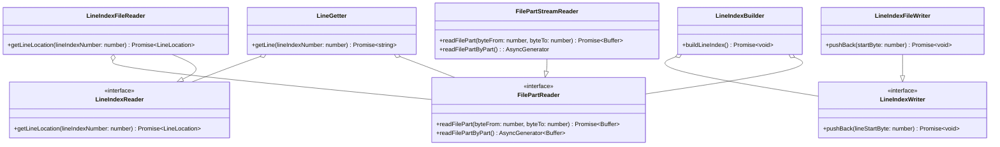
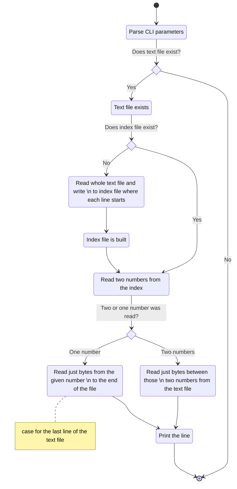

# Reading single line

This is a task for an interview.

## Content

<!-- TOC -->
* [Reading single line](#reading-single-line)
  * [Content](#content)
  * [Task description](#task-description)
  * [High level class diagram](#high-level-class-diagram)
  * [High level algorithm](#high-level-algorithm)
  * [Text file](#text-file)
  * [Index file](#index-file)
    * [Structure](#structure)
<!-- TOC -->

## Task description

You are given a very, very large plain text file where each line contains a plain text string. The
file has at most 1 billion lines; lines may have different lengths, but each line has at most 1000
characters. Your goal is to write a program that will print an arbitrary line from the file. Your
program will be run many times (although you don't know exactly how many times it will be run in
advance), and you don't know in advance which lines might be selected. Thus, your solution should be
optimized to minimize the runtime for each additional execution. The first execution of the program
may take longer than subsequent runs, and you may use additional disk storage to improve
performance. Your program should take two command-line arguments: the path of the input file from
which to print lines, and the index of the line you want to print. Your program should write the
line to standard output.

## High level class diagram

## High level algorithm

## Text file

Text file can contain at most one billion (1 000 000 000) lines. Each line can contain at most 1000
characters, unless it can be more than 1000 bytes. Besides new line characters, one character can be
can use more than 1 byte. So multibyte characters are supported. Also, all main platforms are
supported, in terms of new lines:

- Windows: uses 2 bytes for a new line: CR + LF
- Linux: uses just one byte: LF
- Mac: uses just one byte: CR 

## Index file

It takes some time to create an index file. But if it exists, any line can be printed almost instantly.

### Structure

It is a binary file. There are 8 bytes (unsigned 64-bit integer) per line in the text file. Integers
are put next to each other without any delimiter. Each number determines where the line begins on
the disk, of course relatively. So the first line always starts on byte 0. For following lines, it
works like this:

[beginning of the first line] = 0
[beginning of the second line] = [length of the first line] + [1 or 2 bytes for a new line characters] + 1
[beginning of the third line] = [beginning of the second line] + [length of the second line] + [1 or 2 bytes for a new line characters] + 1
